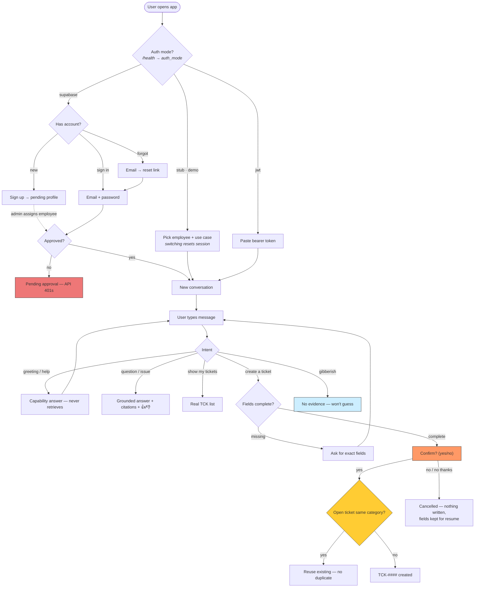

# RegIntel AI

Enterprise Knowledge & Operations Assistant — IIT Patna GenAI Development Program, Project 3.

A configuration-driven agentic assistant: employees ask questions, get evidence-grounded answers with citations, look up and create IT tickets — orchestrated by LangGraph. See `docs/` for the full knowledge base and phase plan.

## 🌐 Live demo

| | |
|---|---|
| **App (Streamlit)** | https://regintel-ai-test.streamlit.app |
| API (Render) | https://regintel-api-xuhl.onrender.com |
| API health | https://regintel-api-xuhl.onrender.com/health |
| API readiness | https://regintel-api-xuhl.onrender.com/ready |
| API docs (Swagger) | https://regintel-api-xuhl.onrender.com/docs |
| OpenAPI spec | https://regintel-api-xuhl.onrender.com/openapi.json |
| Source (GitHub) | https://github.com/abhishekthatguy/regintel-ai |

Sign in by picking a demo employee in the sidebar (`e001` IT · `e002` HR · `e003` Finance · `e999` admin) — no password/token needed in stub mode. Try *"how do I connect to the VPN"* for a cited answer, or the full walkthrough in `docs/demo-script.md`.

> Free tier: the API sleeps after ~15 min idle — if the first message is slow, open the health link once to warm it, then retry.

## Status

**Phase 9 — Production Readiness.** Phase 8 delivered the full local slice; Phase 9 turns the adapter skeletons into working cloud backends: Hugging Face LLM + semantic embeddings (**connected and verified live**), real Redis cache, real DynamoDB store, and Supabase Auth (signup/signin/forgot-password + admin approval) alongside JWT/JWKS. Everything still degrades to local stubs, so the demo runs credential-free.

Recent hardening: conversational cancellation (names the action, keeps context for resume), sidebar session reset on employee/use-case switch, deterministic greeting/capability intents on the HF path, polite declines ("no thanks"), and eval skip-with-reason handling under JWT/Supabase auth. Live-vs-pending tracker: `docs/README.md`.

## Features

- **Evidence-grounded answers** — every claim cites document, section, chunk, excerpt, retrieval/rerank scores, version, and source URL; unanswerable queries get an explicit "won't guess" response
- **Governed write actions** — ticket and CRM case creation share one safety contract: field validation → duplicate detection → explicit confirm → idempotent write → audit
- **Three auth modes** — `stub` (demo), `jwt` (HS256 dev / Entra JWKS), `supabase` (real accounts with admin-assigned employee linking)
- **Multi-turn context** — short follow-ups and "yes" resolve against conversation state; query rewriting expands anaphoric references before retrieval
- **Department-scoped everything** — retrieval filters by the caller's department; tickets/cases scoped to the caller; three departments onboarded by YAML only
- **5 tools behind a server-side allowlist** — knowledge search, ticket lookup/create, CRM lookup/create; user text can never reach a disabled tool
- **Feedback + audit + analytics** — thumbs ratings, full audit log, per-department cost attribution, adoption funnel, unmet-need clustering
- **Ingestion pipeline** — markdown corpus → chunking → hybrid index, checksum drift detection, dead-lettered failures, admin upload endpoint
- **Two UIs** — Streamlit demo app (citations, tool trace, eval runner, admin page) and Angular 21 end-user app (voice I/O, analytics dashboard)
- **Cloud-swappable backends** — LLM (local/HF/Bedrock), embedder (hashing/MiniLM/Titan), store (SQLite/DynamoDB), cache (TTL/Redis), CRM adapter, speech — all via env config

## Problem statement

Enterprise knowledge is fragmented across documents, employee support is slow and inconsistent, and generic chatbots answer without evidence — no citations, weak access control, no audit trail, uncontrolled model cost. (Full business requirements: `RegIntel_AI_Business_Requirements_Document.docx`.)

## Solution overview

A configuration-driven agentic assistant: authenticate an employee, retrieve department-approved knowledge via hybrid search + reranking, answer with full-contract citations, and perform governed actions (tickets, CRM cases) through a LangGraph workflow with validation, duplicate detection, explicit confirmation, idempotency, and audit. Departments and tools are YAML config — no core changes to onboard a new one.

## Architecture

```
Employee (Angular :4200 · Streamlit :8501 · Genesys agent-assist)
      │  NDJSON stream: status → tokens → citations → usage
      ▼
FastAPI ── identity (stub │ JWT/JWKS │ Supabase Auth) ── audit_log ── use-case config
      ▼
LangGraph ── initialize → classify → conditional route
      │        ├─ knowledge_query → build_filters → retrieve → generate → guardrail
      │        ├─ ticket_lookup / crm_lookup
      │        ├─ *_create → clarify → duplicate_check → confirm → write
      │        └─ direct / confirm / cancel / error_handler
      ▼
Tools (server-side allowlist) → hybrid retriever (BM25 + vector → RRF → rerank, ACL-filtered)
      ▼
Store (SQLite │ DynamoDB) · Cache (local TTL │ Redis) · audit · analytics
LLM (local │ HF Inference │ Bedrock) · Embedder (hashing │ MiniLM │ Titan)
```

Deep dive: `docs/architecture.md` · `docs/requirements-traceability.md` · `docs/SUBMISSION.md` (evaluator checklist) · diagrams: `docs/diagrams/agent-graph.mmd` · `system-architecture.mmd` · `user-flow.mmd`.

## Technology stack

Python 3.11+ · LangGraph · FastAPI · Pydantic · SQLite + DynamoDB · local TTL + Redis cache · BM25 + vector hybrid retrieval · Hugging Face Inference Providers (LLM + embeddings) · Supabase Auth · Angular 21 + Tailwind · Streamlit · pytest + ruff (+ fakeredis/moto) · Bedrock/Entra/Genesys/OpenText adapter boundaries (config-swapped).

## Installation

```bash
python3 -m venv .venv
.venv/bin/pip install -e ".[dev]"     # runtime + dev deps (pinned in pyproject.toml)
cp .env.example .env                  # then edit if needed (defaults work)
cp .env.example .env.local            # gitignored — secrets/overrides live here (loaded after .env)
.venv/bin/python scripts/seed_db.py   # demo employees + tickets + knowledge corpus
```

Optional extras:

```bash
.venv/bin/pip install -e ".[cloud]"   # redis + boto3 — real Redis cache / DynamoDB store
```

**Hugging Face** (real LLM + semantic embeddings, free tier — verified live locally):

```bash
# .env.local (gitignored — never commit the token)
REGINTEL_LLM_PROVIDER=hf
REGINTEL_HF_TOKEN=hf_...              # huggingface.co/settings/tokens — enable "Make calls to Inference Providers"
REGINTEL_HF_MODEL=meta-llama/Llama-3.1-8B-Instruct
REGINTEL_EMBEDDER=hf                  # all-MiniLM-L6-v2 semantic retrieval
# then reseed so chunks get MiniLM vectors:
rm data/regintel.db* && .venv/bin/python scripts/seed_db.py
# restart the API afterwards — settings are loaded at process start
```

**Supabase Auth** (real accounts — replaces the demo dropdown):

1. Create a project at supabase.com → copy URL + publishable/secret keys (Settings → API Keys)
2. Run `db/supabase_profiles.sql` in its SQL editor (profiles table + RLS)
3. Set in `.env.local`: `REGINTEL_AUTH_MODE=supabase`, `REGINTEL_SUPABASE_URL`, `REGINTEL_SUPABASE_PUBLISHABLE_KEY`, `REGINTEL_SUPABASE_SECRET_KEY`
4. Sign up in the UI → grab the user UUID (Authentication → Users) → link it to an employee:
   `.venv/bin/python scripts/supabase_link_user.py <auth-user-uuid> e999`

**JWT auth** (crypto validation without Supabase):

```bash
REGINTEL_AUTH_MODE=jwt REGINTEL_JWT_SECRET=dev-secret-... .venv/bin/uvicorn app.main:app --port 8000
.venv/bin/python scripts/mint_dev_token.py --sub e001   # prints a 24h dev token
```

## Run (two terminals)

```bash
# Terminal 1 — API
.venv/bin/uvicorn app.main:app --reload --port 8000

# Terminal 2 — Streamlit demo UI
.venv/bin/streamlit run ui/streamlit_app.py
```

Open http://localhost:8501. Pick a demo employee (header `X-Demo-Employee` carries the identity) and a use case, then chat.

**Angular app** (Phase 4 end-user surface):

```bash
cd ui/web && npm install && npx ng serve
```

Open http://localhost:4200 — chat with streaming + citations + feedback + language selector + voice input (🎤) and read-aloud (🔊), `/analytics` for the admin dashboard (sign in as e999).

## User flow



Full-resolution version with every edge (CRM, employee-ID guard, offer chaining): [`docs/diagrams/user-flow.mmd`](docs/diagrams/user-flow.mmd).

## Environment variables

All optional — defaults run the full demo. Key ones (full list: `.env.example`):

| Variable | Default | Purpose |
|---|---|---|
| `REGINTEL_AUTH_MODE` | `stub` | `stub` = demo employee header; `jwt` = JWT/JWKS validation; `supabase` = Supabase Auth |
| `REGINTEL_SUPABASE_URL` / `REGINTEL_SUPABASE_PUBLISHABLE_KEY` / `REGINTEL_SUPABASE_SECRET_KEY` | — | Supabase project URL + keys (auth mode `supabase`) |
| `REGINTEL_LLM_PROVIDER` | `local` | `hf` = Hugging Face Inference Providers (Llama-3.1-8B); `bedrock` = Converse API. Both self-degrade to local without credentials |
| `REGINTEL_HF_TOKEN` / `REGINTEL_HF_MODEL` | — / `Llama-3.1-8B` | HF access token + instruct model for the `hf` provider |
| `REGINTEL_EMBEDDER` | `local` (hashing) | `hf` = real semantic embeddings via `all-MiniLM-L6-v2` (HF Inference API) |
| `REGINTEL_STORE_BACKEND` / `REGINTEL_CACHE_BACKEND` | `sqlite` / `local` | `dynamodb` / `redis` real cloud backends (need `.[cloud]` extra + credentials) |
| `REGINTEL_DYNAMO_ENDPOINT` / `REGINTEL_REDIS_URL` | AWS / local | override for local DynamoDB / Redis location |
| `REGINTEL_JWT_SECRET` / `REGINTEL_JWT_JWKS_URL` | — | HS256 dev secret / Entra JWKS endpoint |
| `REGINTEL_DB_PATH` / `REGINTEL_SEED_DIR` / `REGINTEL_KNOWLEDGE_DIR` | `data/…` | storage locations |
| `REGINTEL_GUARDRAIL_ID` | — | Bedrock ApplyGuardrail merged with local checks |

## Sample inputs & outputs

As `e001` on the IT Support use case:

- `"how do I connect to the VPN"` → grounded answer + citations (KB-IT-001…: doc, section, excerpt, scores, version, source URL)
- `"what is the cafeteria menu"` → explicit not-found — never invents
- `"create a ticket my laptop battery drains in an hour"` → confirm prompt → `yes` → `TCK-1xxx created`; repeat → duplicate reused
- `"check my case CASE-7001"` → CRM case (as `e002` → correctly not found)

Full scripted walkthrough with expected outputs: `docs/demo-script.md`.

## Key design decisions

- **LangGraph over a monolithic prompt** — explicit nodes/edges make routing testable and the node trace demoable.
- **Tools behind a server-side allowlist** — use-case YAML decides what's enabled; user text can never reach a disabled tool.
- **One safety contract for all writes** — tickets and CRM cases share validate → dedupe → confirm → idempotent → audit.
- **Adapter seams everywhere** — identity, LLM, embedder, reranker, store, cache, CRM, speech, ingestion sources all swap by config; local impls keep the demo credential-free.
- **Deterministic local model by default** — reproducible tests/eval without API keys; Bedrock generates fluent prose when configured.

Rationale + open questions: `docs/decisions-and-open-questions.md`.

## Test

```bash
.venv/bin/pytest          # test suite
.venv/bin/ruff check .    # lint
```

## Layout

```
app/
  api/        FastAPI routes (health, conversations, streaming, feedback, admin)
  agent/      AgentRunner protocol, LangGraphRunner + graph (all §9 nodes)
  config/     UseCaseLoader — versioned YAML use-case config (DynamoDB boundary)
  guardrails/ input/output checks + Bedrock ApplyGuardrail boundary
  identity/   IdentityProvider protocol + stub + JWT (HS256 dev / Entra JWKS) + Supabase
  ingestion/  SourceAdapter (local files live, OpenText/Graph skeletons) + pipeline
  llm/        ChatModel protocol + local + HFChatModel + BedrockChatModel
  retrieval/  BM25 + hashing-vector hybrid (RRF) + reranker (OpenSearch/Bedrock swap)
  schemas/    Pydantic contracts: Message, Conversation, Citation, AgentState,
              ToolResult, UseCaseConfig, StreamEvent
  stores/     SQLiteStore + DynamoDBStore (4 tables + GSIs); audit_log, chunks, jobs
  tools/      knowledge_search, ticket_lookup, ticket_create, crm_lookup,
              crm_case_create behind ToolContext
  crm/        CRMAdapter interface + LocalCRMAdapter (JSON seed, write-through)
  integrations/ genesys.py — agent-assist suggestion surface
  speech.py   SpeechProvider boundary (browser Web Speech / AWS skeleton)
  audit.py    NFR-12 audit records; cache.py FR-21 cache boundary
  lambda_handler.py  Mangum entry point for Lambda + API Gateway
  middleware.py   correlation-ID middleware
  logging_config.py  JSON logs + sensitive-field redaction
ui/
  streamlit_app.py  chat UI: streamed answers, citations, tool trace, feedback
  pages/2_Admin.py  use-case config + data inspection (FR-27)
  pages/3_Eval.py   golden-suite runner + report (FR-26)
  web/            Angular 21 end-user app (chat, citations, feedback, analytics)
data/
  knowledge/  sample corpus (IT + HR + Finance + Security + Facilities markdown)
  usecases/   versioned use-case configs (it_support, hr_support, finance_support)
  seed/       demo employees + tickets + CRM cases
eval/         golden_cases.json + rubric runner
scripts/      seed_db.py, load_test.py (P95 vs NFR targets), export_openapi.py,
              mint_dev_token.py, supabase_link_user.py, hf_refresh_token.py
tests/
docs/         knowledge base + phase plans
```

## API

| Endpoint | Purpose |
|---|---|
| `GET /` | Service metadata (name, version, auth mode, doc links) |
| `GET /health`, `GET /ready` | Liveness / readiness probes |
| `POST /v1/auth/signup` · `/signin` · `/forgot-password` · `/signout` | Account lifecycle (auth mode `supabase`) |
| `GET /v1/auth/me` | Resolved caller identity (employee + roles) |
| `GET /v1/auth/pending` · `POST /v1/auth/assign-employee` | Admin: list pending signups, link profile → employee (`admin` role) |
| `POST /v1/conversations` | Create conversation (body: `{usecase_id?, title?}`) |
| `GET /v1/conversations` | List caller's conversations |
| `GET /v1/conversations/{id}` | Load conversation + messages (owner only) |
| `GET /v1/conversations/{id}/export` | Owner-scoped transcript (markdown/JSON) with citations |
| `POST /v1/conversations/{id}/messages:stream` | Send message → NDJSON event stream (`status`, `token`, `citation`, `usage`, `complete`, `error`) |
| `PATCH /v1/conversations/{id}` | Rename (`title`) or archive (`status`) a conversation |
| `POST /v1/messages/{id}/feedback` | Thumbs rating + reason + comment, linked to message/conversation |
| `POST /v1/admin/ingestions` | Start an ingestion job (`admin` role; body: `{source: local_files\|opentext\|msgraph}`) |
| `GET /v1/admin/ingestions` / `/{job_id}` | Ingestion job status + dead-lettered failures |
| `GET /v1/admin/analytics` | Usage/feedback/latency/not-found aggregates (`admin` role) |
| `POST /v1/integrations/genesys/suggest` | Agent-assist: `{utterance, usecase_id?}` → grounded suggestion + citations (stateless) |
| `GET /v1/admin/usecases` / `/{id}` | Department-owner self-service: config, tools, guardrails, indexed docs, usage (`admin` role) |
| `POST /v1/admin/knowledge` | Upload a markdown doc w/ front-matter → validated → ingested (`admin` role) |

Demo identity via `X-Demo-Employee: e001|e002|e003|e999` header in stub mode (`e999` carries the `admin` role). With `REGINTEL_AUTH_MODE=jwt`, every request needs a Bearer JWT validated for signature/issuer/audience/expiry — mint a dev token via `scripts/mint_dev_token.py` (requires `REGINTEL_JWT_SECRET`); Entra JWKS validation plugs in via `REGINTEL_JWT_JWKS_URL`. With `supabase`, sign up/sign in in the UI; access is granted only after an admin links the pending profile to an employee record.

## Technical debt / known limitations

- **Default LLM is deterministic-local** — grounded answers are composed extractively from retrieved chunks, not generated prose. `REGINTEL_LLM_PROVIDER=hf` (or `bedrock`) flips to a real model; safety-critical text (confirm/clarify/refuse) stays template-based either way.
- **Default embeddings are hashing-based** — no semantic similarity until `REGINTEL_EMBEDDER=hf` is set; requires a reseed (existing chunks keep their vector space).
- **SQLite on Render's free tier is ephemeral** — the DB re-ingests on each cold boot (fine for demos); production should set `REGINTEL_STORE_BACKEND=dynamodb` (implemented, moto-tested) or a managed Postgres.
- **Deployed demo runs `stub` auth** — deliberate, so evaluators can click through; `jwt`/`supabase` are env flips documented in `docs/deployment.md`.
- **Supabase approval is admin-driven** — new signups sit pending until an admin runs `assign-employee` (or the bootstrap script); no self-service access.
- **Free-tier cold starts** — Render API sleeps ~15 min idle; HF inference adds ~15–30s on first call per model. Warm `/health` before demoing.
- **Ingestion sources** — only `local_files` is live; OpenText/MS Graph adapters are fail-closed skeletons by design (config-swappable).
- **Speech** — browser Web Speech only; AWS Transcribe/Polly boundary exists but is unwired.
- **Genesys** — the agent-assist endpoint is live and stateless; real Genesys org provisioning is pending (OQ-01).
- **Admin bootstrap** — first admin must be linked via `scripts/supabase_link_user.py`; no UI for the initial grant.

## Implementation notes

- LLM is a deterministic local implementation (`app/llm/local.py`) — grounded answers are composed extractively from retrieved chunks. Real providers plug in via `REGINTEL_LLM_PROVIDER=hf` (Hugging Face Inference Providers, needs `REGINTEL_HF_TOKEN`) or `bedrock` (Converse API); both self-degrade to local without credentials.
- Retrieval is local hybrid: BM25 + deterministic hashing-vector cosine merged via reciprocal-rank fusion, then `LocalReranker` rescoring (`app/retrieval/`). OpenSearch + Bedrock Titan/Cohere swap in via `models.embedding`/`models.rerank` config.
- Ingestion pipeline (`app/ingestion/`): `SourceAdapter` interface with local-files adapter live and OpenText/Graph skeletons that fail closed; checksum drift detection re-indexes changed docs; per-doc failures land in the `ingestion_failures` dead-letter table.
- Citations carry the full §10.1 contract: document, section, chunk, excerpt, retrieval + rerank scores, version, source URL/ref, access decision.
- Auth: demo header (`X-Demo-Employee`) in stub mode; JWT mode does real crypto validation (HS256 dev key / Entra RS256 via JWKS); `supabase` mode proxies GoTrue server-side — signup/signin/forgot-password — with tokens verified via JWKS and profiles resolved to employees through the `profiles` table (admin-assigned).
- Cloud backends are live, not stubs: `REGINTEL_STORE_BACKEND=dynamodb` (full 36-method store, moto-tested), `REGINTEL_CACHE_BACKEND=redis` (JSON values, TTL, SCAN invalidation, local fallback), `REGINTEL_LLM_PROVIDER=hf`/`bedrock`, `REGINTEL_GUARDRAIL_ID`. All degrade to local without credentials. `app/lambda_handler.py` provides the Lambda entry point.
- Security-relevant actions write to the `audit_log` table (actor, action, outcome, config context).
- Angular app (`ui/web/`) is the end-user surface; Entra MSAL login swaps in once the app registration exists (bearer-token input today). Multilingual selection is recorded and routed to the model boundary — the local model discloses English-only.
- Multi-turn state persists in the SQLite checkpointer; per-employee ticket scoping is enforced server-side.
- Phase 5/6: `crm_lookup` + `crm_case_create` tools via the `CRMAdapter` interface (`LocalCRMAdapter` over `data/seed/crm_cases.json`, scoped to the caller, write-through persisted). Case creation follows the identical safety contract as tickets: validation → duplicate check → explicit confirmation → idempotent write → audit. Disabled per use case via the server-side allowlist.
- Advanced analytics: `/v1/admin/analytics` adds `by_department` (cost attribution), `funnel` (adoption), and `unmet_needs` (clustered not-found queries); surfaced on the Angular `/analytics` dashboard.
- Voice: browser Web Speech API — mic transcription fills the draft and flows through the identical text pipeline (transcript preserved as the stored message); 🔊 reads responses aloud. `app/speech.py` is the provider boundary for AWS Transcribe/Polly when credentials exist.
- Genesys: `/v1/integrations/genesys/suggest` is the agent-assist surface — utterance → grounded suggestion + citations, stateless, same auth as everything else. A real Genesys data action calls it with an OAuth JWT (JWT mode); org provisioning is pending OQ-01.
- Third department: `finance_support` is YAML + Finance corpus + `e003` — zero new business logic (UJ-07).
- Phase 7: `POST /v1/admin/knowledge` lets dept owners upload markdown (validated front-matter, `KB-DEPT-NNN` doc IDs, safe filenames) — ingested and citable in the same pipeline. `scripts/load_test.py` measures P95 first-token/answer latency against NFR targets (local model: ~65/70ms). `scripts/export_openapi.py` + `docs/demo-script.md` are the handoff artifacts.
- Phase 8: `GET /v1/conversations/{id}/export` gives an owner-scoped markdown/JSON transcript with citations (Angular has an export button). FR-16 query rewriting (`app/retrieval/rewriter.py`) expands short/anaphoric follow-ups with conversation context before retrieval — Haiku path when `models.enrichment` is cloud-configured. `eval/runner.py` reports per-case rubric dims + `rubric_means`. `estimated_cost_usd` now reflects a real per-model rate table (`app/llm/pricing.py`); local stays 0. `BedrockChatModel` implements the full `ChatModel` protocol. CI runs lint + pytest (incl. golden eval) + Angular build on master.
